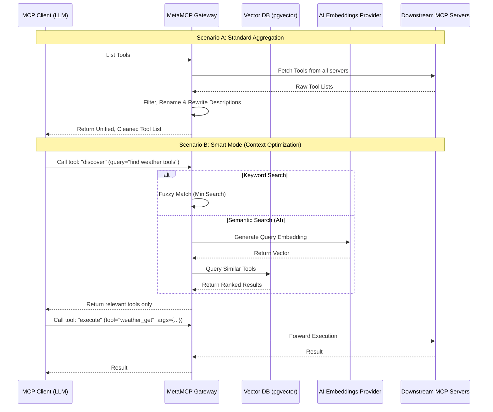

# 🚀 MetaMCP
### The Intelligent MCP Gateway: Aggregator, Orchestrator, & Smart Semantic Search <div align="center">

<div align="center">
  <a href="https://opensource.org/licenses/MIT" style="text-decoration: none;">
    
  </a>
  <a href="https://github.com/metatool-ai/metamcp/pkgs/container/metamcp" style="text-decoration: none;">
    
  </a>
</div>

</div>

**MetaMCP** is the next-generation proxy for the Model Context Protocol (MCP). It aggregates multiple MCP servers into a single, unified endpoint and acts as an intelligent gateway for your LLMs.

> 🏆 **The First & Only Open Source MCP Solution with True Semantic Intelligence.**
>
> While other proxies simply list tools, MetaMCP actively manages them. It is currently the **only** open-source tool capable of aggregating servers, rewriting tool definitions on the fly, AND performing AI-driven semantic search to drastically reduce context window usage.

### ⚡ Why MetaMCP?

As you add more MCP servers (Filesystem, GitHub, Postgres, Slack), the list of available tools grows to thousands of lines of JSON. Feeding this entire list to an LLM consumes massive amounts of context tokens, increases costs, and confuses the model.

**MetaMCP solves this with Smart Mode.** Instead of dumping 500+ tools into the context, MetaMCP presents just two: `discover` and `execute`.

| Feature | Description |
| :--- | :--- |
| 🧠 **AI-Powered Smart Mode** | Uses embeddings (Vector Search) or Fuzzy Matching to find the exact tools the LLM needs, when it needs them. |
| 📉 **Context Reduction** | Reduces context usage by up to 90% by hiding unused tools until discovery. |
| ✂️ **Smart Truncation** | Automatically strips verbose schemas from descriptions before embedding, ensuring searches focus on core functionality. |
| 🔧 **Tool Transformation** | Dynamically filter, rename, and rewrite tool descriptions *before* the LLM ever sees them. |
| 🔌 **Vendor Agnostic** | Plug in **any** OpenAI-compatible embeddings provider (Ollama, DeepInfra, OpenAI, etc.). |
| 🗄️ **Persistent Vector DB** | Includes a built-in PostgreSQL + `pgvector` setup for lightning-fast semantic retrieval. |

---


English | [中文](./README_cn.md)

## 📋 Table of Contents - [🎯 Use Cases](#-use-cases)
- [📖 Concepts](#-concepts)
  - [🖥️ MCP Server Management](#️-mcp-server-management)
  - [🧠 Smart Mode (The Context Saver)](#-smart-mode-the-context-saver)
  - [✂️ Smart Truncation & Embeddings](#️-smart-truncation--embeddings)
  - [✏️ Tool Filtering, Renaming & Overrides](#️-tool-filtering-renaming--overrides)
- [🏗️ Architecture & Logic Flow](#️-architecture--logic-flow)
- [🚀 Quick Start](#-quick-start)
- [🔌 Connect to MetaMCP](#-connect-to-metamcp)
- [🔐 Authentication & Enterprise](#-authentication--enterprise)
- [🤝 Contributing](#-contributing)

## 🎯 Use Cases

- **Unified Gateway:** Host 10+ MCP servers (e.g., Brave Search, Google Drive, Linear) behind a single Endpoint URL.
- **Context Optimization:** Use **Smart Mode** to allow Agents to access hundreds of tools without exceeding token limits or confusing the model.
- **Security & Governance:** Rename tools to follow internal conventions and hide tools that agents shouldn't access (e.g., hiding `delete_file` from a filesystem MCP).
- **Enterprise Deployment:** Multi-tenancy, OIDC/SSO support, and API Key management out of the box.

## 📖 Concepts

### 🖥️ MCP Server Management
MetaMCP connects to "Downstream" MCP servers. These can be stdio-based (Docker managed) or remote HTTP/SSE servers.

**Environment Variables:**
MetaMCP handles secrets securely. You can pass raw values or reference environment variables from the parent container:
```json
"HackerNews": {
  "type": "STDIO",
  "command": "uvx",
  "args": ["mcp-hn"],
  "env": {
    "API_KEY": "${OPENAI_API_KEY}" // Resolves safely at runtime
  }
}
```

### 🧠 Smart Mode (The Context Saver)

This is the core innovation of this fork. When Smart Mode is enabled, the LLM does not see the full list of 100+ tools. It sees only:
1.  **`discover`**: Takes a natural language query (e.g., "I need to check the latest PRs on the frontend repo").
2.  **`execute`**: Executes a specific tool by name.

**Search Strategies:**
* **Keyword (Fuzzy):** Fast, no external API needed. Good for exact tool names.
* **AI Semantic Search (Embeddings):** The heavy hitter. Converts tool descriptions and user queries into vectors. It understands that "check the weather" matches a tool named `get_meteorological_data`.

### ✂️ Smart Truncation & Embeddings

Raw tool descriptions often contain verbose schemas, argument definitions, and boilerplate that can confuse semantic search. MetaMCP includes a configurable **Truncation Engine** to clean data before embedding.

By default, we strip everything after the first newline (often separating the description from the schema) to ensure the AI focuses only on what the tool *does*.

**Configuration (.env):**
```bash
# Enable truncation logic
EMBEDDING_TRUNCATE_ENABLED=true

# Split on newlines (detects end of description)
EMBEDDING_TRUNCATE_DELIMITER="\n" 

# Keep text before the first occurrence of the delimiter
EMBEDDING_TRUNCATE_OCCURRENCE=1    

# Skip truncation if the result is too short (prevents empty embeddings)
EMBEDDING_TRUNCATE_MIN_LENGTH=5    
```
*Note: Because you can rewrite tool descriptions in the UI, you can insert your own custom delimiters to perfectly tune how your tools are indexed.*

### ✏️ Tool Filtering, Renaming & Overrides

Sometimes upstream MCP servers provide poor descriptions or confusing names. MetaMCP allows you to transform these definitions on the fly.

* **Filter:** Completely hide specific tools from the aggregated list (e.g., disable `delete_database`).
* **Rename:** Change `func_a1` to `get_customer_data` so the LLM understands it.
* **Rewrite Descriptions:** Improve prompt adherence by clarifying what a tool does.
* **Annotations:** Attach custom metadata (e.g., `readOnlyHint`) to specific tools.

All of this is managed via the UI and persisted in the database.

## 🏗️ Architecture & Logic Flow

Unlike other proxies that simply pass traffic, MetaMCP acts as an intelligent transformation layer.

### How MetaMCP Handles Requests



## 🚀 Quick Start

### 🐳 Run with Docker Compose (Recommended)

1.  Clone the repository:
    ```bash
    git clone https://github.com/lukolszewski/metamcp.git
    cd metamcp
    ```

2.  Configure Environment:
    ```bash
    cp example.env .env
    # Edit .env to set your Embeddings Provider (Ollama, OpenAI, etc.)
    ```

3.  Launch:
    ```bash
    docker compose up -d
    ```

    *Access the UI at `http://localhost:3000` (or your configured port).*

### 🔧 Development Environment
We support **Dev Containers** for VSCode and Cursor. Simply open the project and click "Reopen in Container". This sets up the Node.js runtime, Docker-in-Docker, and PostgreSQL automatically.

## 🔌 Connect to MetaMCP

MetaMCP exposes endpoints compatible with any MCP Client (Claude Desktop, Cursor, etc.).

**Example `mcp.json` for Cursor:**
```json
{
  "mcpServers": {
    "MetaMCP": {
      "url": "http://localhost:12008/metamcp/<YOUR_ENDPOINT_NAME>/sse"
    }
  }
}
```

**For Claude Desktop (using mcp-proxy):**
```json
{
  "mcpServers": {
    "MetaMCP": {
      "command": "uvx",
      "args": [
        "mcp-proxy",
        "http://localhost:12008/metamcp/<YOUR_ENDPOINT_NAME>/sse"
      ],
      "env": {
        "API_ACCESS_TOKEN": "<YOUR_API_KEY>"
      }
    }
  }
}
```

## 🔐 Authentication & Enterprise

MetaMCP is built for scale:
* **OIDC/SSO:** Connect to Auth0, Keycloak, Google, or Azure AD.
* **Registration Controls:** Independently toggle UI Signups vs SSO Signups.
* **Multi-Tenancy:** Users see their own namespaces; Admins manage global configurations.

## 🤝 Contributing

We are building the most advanced MCP gateway in the open-source ecosystem.
See **[CONTRIBUTING.md](CONTRIBUTING.md)** for details on how to submit PRs.

## 📄 License

**AGPL-3.0**
*Note: This project is a hard fork of the original MIT-licensed MetaMCP proxy. Due to the significant addition of Smart Mode, AI Embeddings, and Vector Database, this fork is released under AGPL-3.0.*