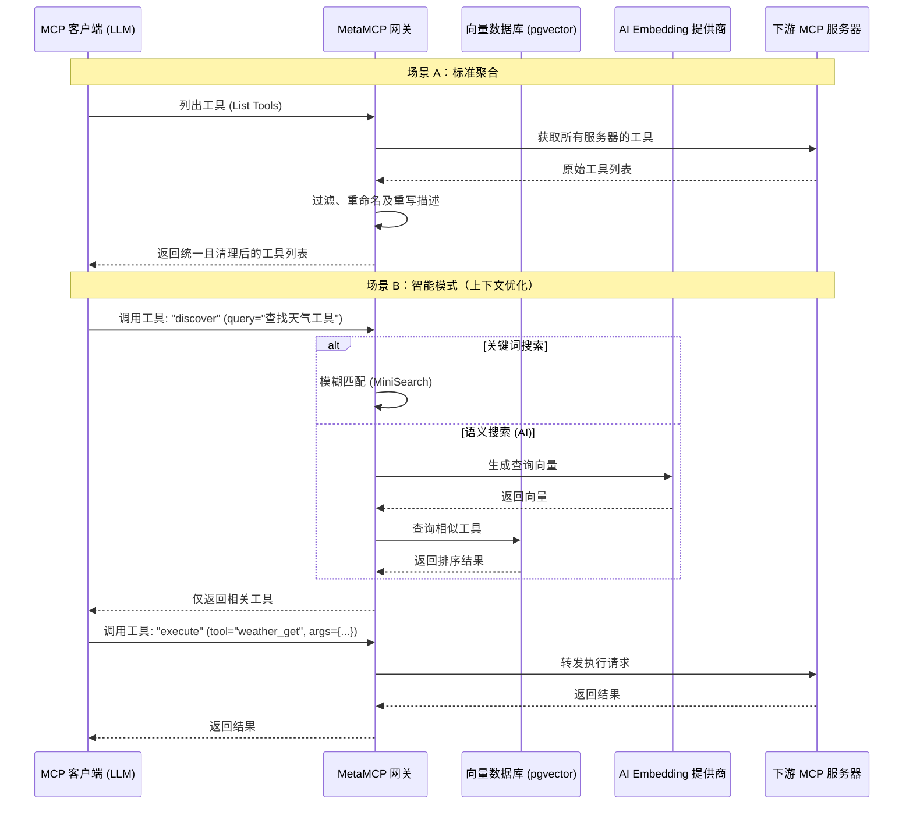

# 🚀 MetaMCP
### 智能 MCP 网关：聚合器、编排器与智能语义搜索 <div align="center">

<div align="center">
  <a href="https://opensource.org/licenses/MIT" style="text-decoration: none;">
    
  </a>
  <a href="https://github.com/metatool-ai/metamcp/pkgs/container/metamcp" style="text-decoration: none;">
    
  </a>
</div>

</div>

**MetaMCP** 是模型上下文协议（MCP）的下一代代理。它将多个 MCP 服务器聚合为一个统一的端点，并充当 LLM 的智能网关。

> 🏆 **首个且唯一具备真正语义智能的开源 MCP 解决方案。**
>
> 其他代理仅仅是罗列工具，而 MetaMCP 则主动管理它们。它是目前**唯一**能够聚合服务器、动态重写工具定义，**并且**执行 AI 驱动的语义搜索以大幅减少上下文窗口占用的开源工具。

### ⚡ 为什么选择 MetaMCP？

随着你添加更多的 MCP 服务器（Filesystem, GitHub, Postgres, Slack），可用工具列表会增长到数千行 JSON。将整个列表投喂给 LLM 会消耗大量的上下文 Token，增加成本，并混淆模型。

**MetaMCP 通过智能模式（Smart Mode）解决了这个问题。** MetaMCP 不会将 500 多个工具全部丢入上下文，而是只展示两个工具：`discover`（发现）和 `execute`（执行）。

| 特性 | 描述 |
| :--- | :--- |
| 🧠 **AI 驱动的智能模式** | 使用 Embeddings（向量搜索）或模糊匹配，在 LLM 需要时精确找到所需的工具。 |
| 📉 **上下文缩减** | 通过隐藏未使用的工具直到被“发现”，可减少高达 90% 的上下文使用。 |
| ✂️ **智能截断** | 在生成 Embedding 之前自动从描述中剥离冗长的 Schema，确保搜索专注于核心功能。 |
| 🔧 **工具转换** | 在 LLM 看到工具**之前**，动态过滤、重命名和重写工具描述。 |
| 🔌 **供应商无关** | 可接入 **任何** OpenAI 兼容的 Embedding 提供商（Ollama, DeepInfra, OpenAI 等）。 |
| 🗄️ **持久化向量数据库** | 内置 PostgreSQL + `pgvector` 设置，实现极速语义检索。 |

---


[English](./README.md) | 中文

## 📋 目录 - [🎯 使用场景](#-使用场景)
- [📖 核心概念](#-核心概念)
  - [🖥️ MCP 服务器管理](#️-mcp-服务器管理)
  - [🧠 智能模式（上下文救星）](#-智能模式上下文救星)
  - [✂️ 智能截断与 Embeddings](#️-智能截断与-embeddings)
  - [✏️ 工具过滤、重命名与覆盖](#️-工具过滤重命名与覆盖)
- [🏗️ 架构与逻辑流](#️-架构与逻辑流)
- [🚀 快速开始](#-快速开始)
- [🔌 连接到 MetaMCP](#-连接到-metamcp)
- [🔐 认证与企业级功能](#-认证与企业级功能)
- [🤝 贡献指南](#-贡献指南)

## 🎯 使用场景

- **统一网关：** 将 10+ 个 MCP 服务器（如 Brave Search, Google Drive, Linear）托管在单个端点 URL 之后。
- **上下文优化：** 使用 **智能模式** 允许 Agent 访问数百个工具，而不会超出 Token 限制或混淆模型。
- **安全与治理：** 重命名工具以遵循内部规范，并隐藏 Agent 不应访问的工具（例如隐藏文件系统 MCP 中的 `delete_file`）。
- **企业级部署：** 开箱即用的多租户、OIDC/SSO 支持和 API Key 管理。

## 📖 核心概念

### 🖥️ MCP 服务器管理
MetaMCP 连接到“下游”MCP 服务器。这些可以是基于 stdio（Docker 管理）或远程 HTTP/SSE 服务器。

**环境变量：**
MetaMCP 安全地处理机密信息。你可以传递原始值或引用父容器中的环境变量：
```json
"HackerNews": {
  "type": "STDIO",
  "command": "uvx",
  "args": ["mcp-hn"],
  "env": {
    "API_KEY": "${OPENAI_API_KEY}" // 在运行时安全解析
  }
}
```

### 🧠 智能模式（上下文救星）

这是本分支的核心创新。启用智能模式后，LLM 不会看到 100 多个工具的完整列表。它只看到：
1.  **`discover`**：接受自然语言查询（例如，“我需要检查前端仓库的最新 PR”）。
2.  **`execute`**：按名称执行特定工具。

**搜索策略：**
* **关键词搜索（模糊匹配）：** 速度快，无需外部 API。适用于确切的工具名称。
* **AI 语义搜索（Embeddings）：** 重量级功能。将工具描述和用户查询转换为向量。它能理解“查看天气”与名为 `get_meteorological_data` 的工具是匹配的。

### ✂️ 智能截断与 Embeddings

原始工具描述通常包含冗长的 Schema、参数定义和样板文字，这可能会干扰语义搜索。MetaMCP 包含一个可配置的 **截断引擎**，用于在生成 Embedding 之前清理数据。

默认情况下，我们会剥离第一个换行符之后的所有内容（通常用于分隔描述与 Schema），以确保 AI 仅关注工具的**功能**。

**配置 (.env):**
```bash
# 启用截断逻辑
EMBEDDING_TRUNCATE_ENABLED=true

# 按换行符分割（检测描述的结尾）
EMBEDDING_TRUNCATE_DELIMITER="\n" 

# 保留分隔符第一次出现之前的内容
EMBEDDING_TRUNCATE_OCCURRENCE=1    

# 如果结果太短则跳过截断（防止生成空 Embedding）
EMBEDDING_TRUNCATE_MIN_LENGTH=5    
```
*注意：由于你可以在 UI 中重写工具描述，你可以插入自定义的分隔符来完美调整工具的索引方式。*

### ✏️ 工具过滤、重命名与覆盖

有时上游 MCP 服务器提供的描述很差或名称令人困惑。MetaMCP 允许你动态转换这些定义。

* **过滤：** 从聚合列表中完全隐藏特定工具（例如，禁用 `delete_database`）。
* **重命名：** 将 `func_a1` 更改为 `get_customer_data`，以便 LLM 理解。
* **重写描述：** 通过阐明工具的作用来提高 Prompt 遵循度。
* **注解：** 为特定工具附加自定义元数据（例如 `readOnlyHint`）。

所有这些都通过 UI 进行管理，并持久化存储在数据库中。

## 🏗️ 架构与逻辑流

与其他简单转发流量的代理不同，MetaMCP 充当了一个智能转换层。

### MetaMCP 如何处理请求



## 🚀 快速开始

### 🐳 使用 Docker Compose 运行（推荐）

1.  克隆仓库：
    ```bash
    git clone https://github.com/lukolszewski/metamcp.git
    cd metamcp
    ```

2.  配置环境：
    ```bash
    cp example.env .env
    # 编辑 .env 以设置你的 Embedding 提供商 (Ollama, OpenAI 等)
    ```

3.  启动：
    ```bash
    docker compose up -d
    ```

    *访问 UI：`http://localhost:3000`（或你配置的端口）。*

### 🔧 开发环境
我们支持 VSCode 和 Cursor 的 **Dev Containers**。只需打开项目并点击 "Reopen in Container"。这将自动设置 Node.js 运行时、Docker-in-Docker 和 PostgreSQL。

## 🔌 连接到 MetaMCP

MetaMCP 暴露的端点兼容任何 MCP 客户端（Claude Desktop, Cursor 等）。

**Cursor 的 `mcp.json` 示例：**
```json
{
  "mcpServers": {
    "MetaMCP": {
      "url": "http://localhost:12008/metamcp/<YOUR_ENDPOINT_NAME>/sse"
    }
  }
}
```

**Claude Desktop (使用 mcp-proxy)：**
```json
{
  "mcpServers": {
    "MetaMCP": {
      "command": "uvx",
      "args": [
        "mcp-proxy",
        "http://localhost:12008/metamcp/<YOUR_ENDPOINT_NAME>/sse"
      ],
      "env": {
        "API_ACCESS_TOKEN": "<YOUR_API_KEY>"
      }
    }
  }
}
```

## 🔐 认证与企业级功能

MetaMCP 专为规模化设计：
* **OIDC/SSO：** 连接到 Auth0, Keycloak, Google, 或 Azure AD。
* **注册控制：** 独立切换 UI 注册与 SSO 注册。
* **多租户：** 用户只能看到自己的命名空间；管理员管理全局配置。

## 🤝 贡献指南

我们正在构建开源生态系统中最先进的 MCP 网关。
详见 **[CONTRIBUTING.md](CONTRIBUTING.md)** 了解如何提交 PR。

## 📄 许可证

**AGPL-3.0**
*注意：本项目是原始 MIT 许可的 MetaMCP 代理的硬分叉（Hard Fork）。由于增加了智能模式、AI Embeddings 和数据库持久化等重大功能，本分支根据 AGPL-3.0 发布。*